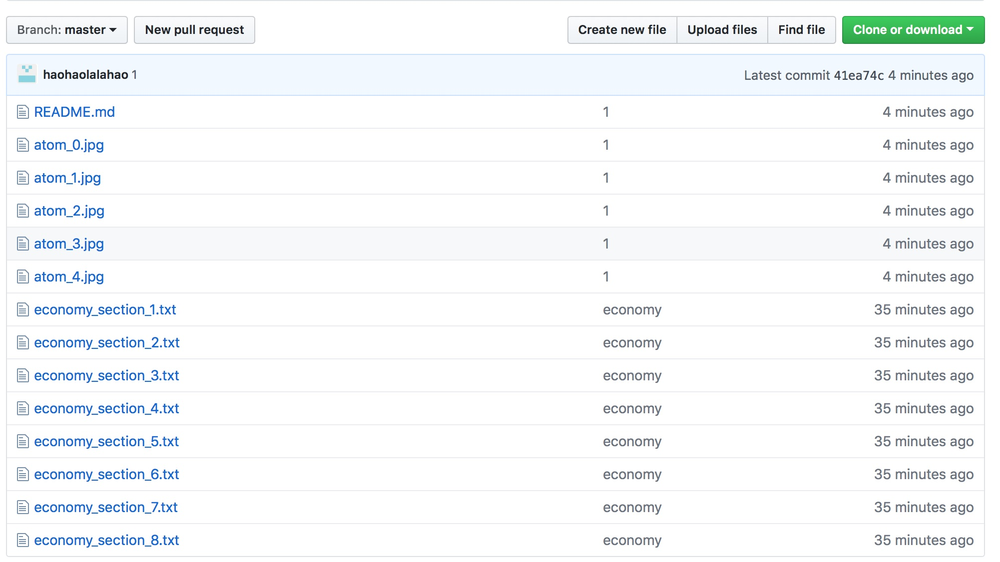
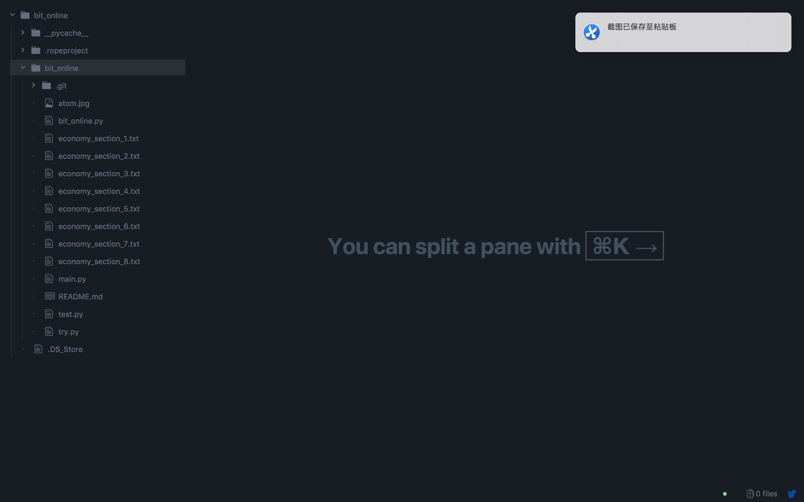
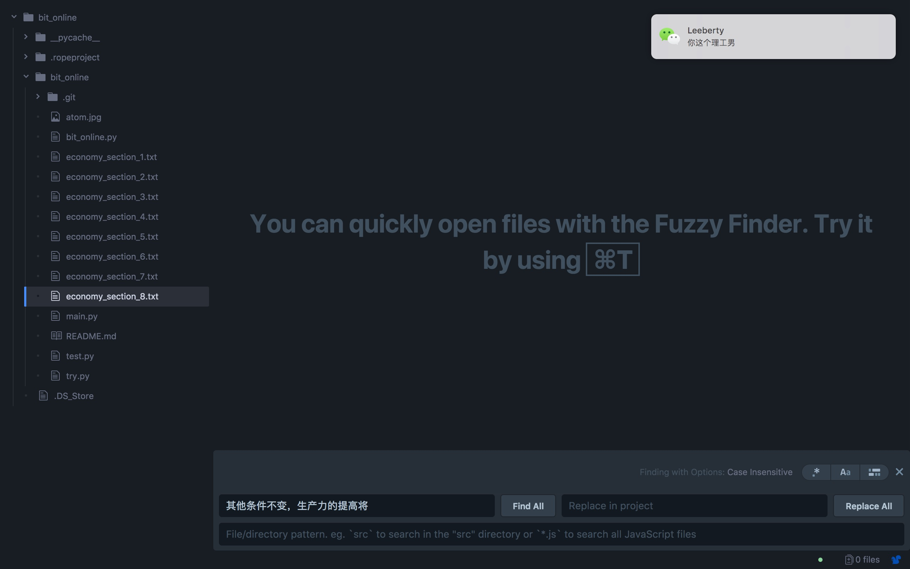
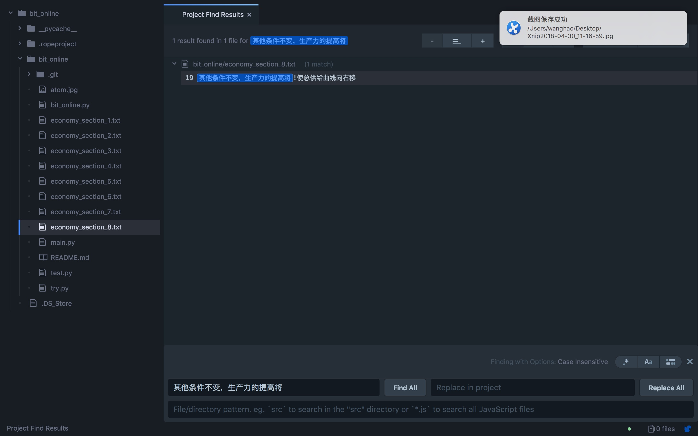

# bit_economy
> 用爬虫爬取了北理乐学2018年经济学概论前八周测试题的答案，感谢参与同学对题库的贡献，题库已更新完毕，源码见bit_online.py。

## 如果觉得此题库对您有所贡献，可否点击右上角的Star，为我点亮一颗小星星！

## 更新信息
**如有问题或者想有所交流，请加WeChat：hh540107804**

**题库更新**

**请下载最新的economy_section_more.txt文件**

**考试内容基本上出自于题库**

**祝大家好运**

## 题库详细使用步骤
- **请前往[atom](https://atom.io)下载安装编辑器。**
    

- **在此页面下载** *economy_section1.txt - economy_section8.txt* **共八个文件(点击右侧绿色clone or download），并将所有文件放入同一文件夹下。**
    

- **启动atom**，**标签栏左上角点击** *File* **后选择** *Open Project* **或者** *Add Project Folder* **将文件夹导入到编辑器中。**
    
    
- *command/ctrl+shift+F* **开启全局搜索，将题干复制到下方控制台，并点击Find All,即可查题。**
    
- *demo* **实例**
    
    

